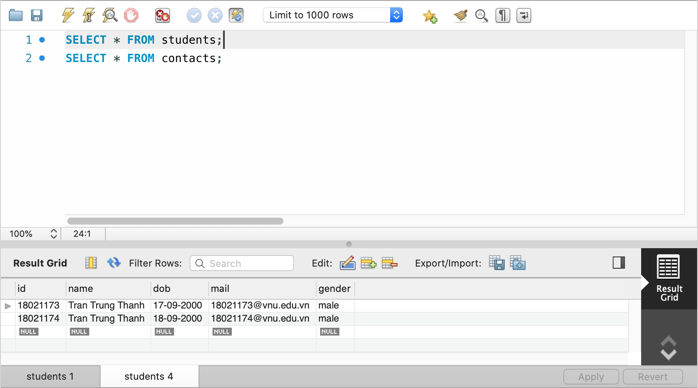
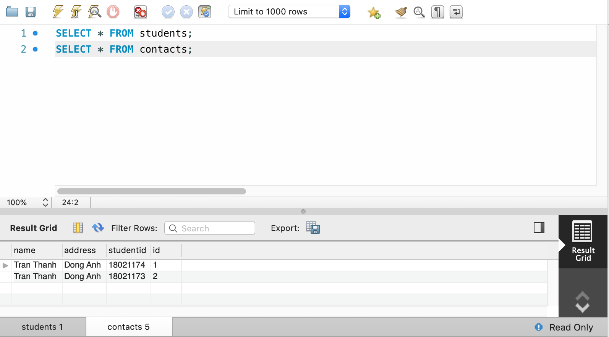
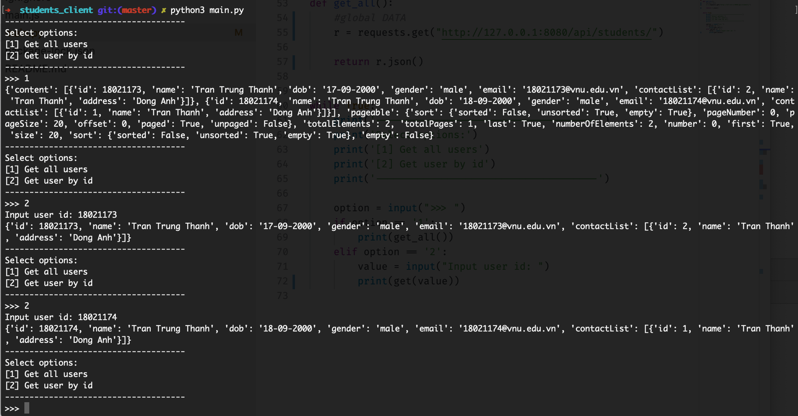
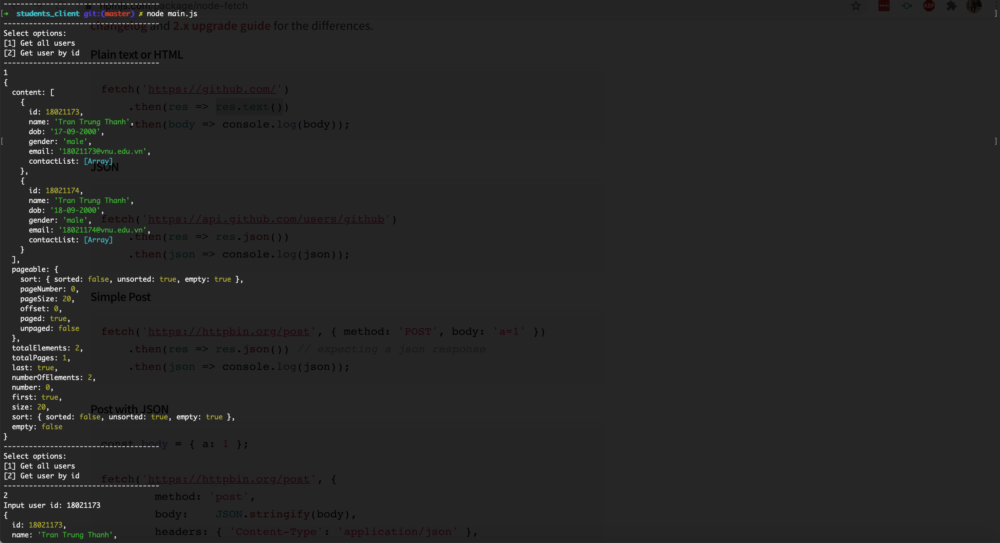
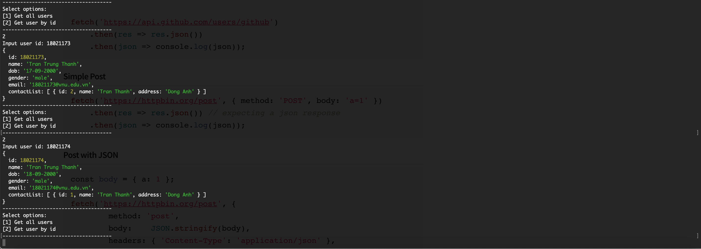

This Back-end use MySQL.

- Import src/main/resources/databse/final.sql to MySQL.

- Change application.properties to src/main/resources with below content

```
spring.jpa.hibernate.ddl-auto=none
spring.datasource.url= jdbc:mysql://localhost:3306/students
spring.datasource.username= //username
spring.datasource.password= //password 
```

- Run DemoApplication.








